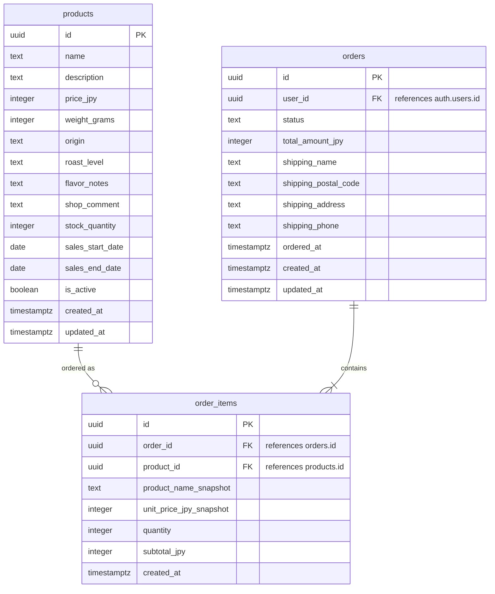

# カフェ豆オンライン店舗 初期計画

## 目的

自家焙煎のコーヒー豆を月に3〜4種類だけ販売する、小さなオンライン店舗を作る。  
季節限定・少量販売の特別感と、店主の選定や焙煎へのこだわりが伝わる購入体験を重視する。

初回リリースでは、商品を分かりやすく見せ、在庫や販売期間を確認し、カートから注文まで進める最小構成を目指す。

## 想定ユーザー

### ペルソナ1: 29歳・会社員

- 在宅勤務が多く、自宅でハンドドリップを楽しんでいる。
- コーヒー豆の種類が多いと選ぶのに迷いやすい。
- 味の専門用語よりも、「すっきり」「甘い」「朝に飲みたい」などの感覚で選びたい。
- 仕事前や休憩時間に、短時間で自分に合う豆を見つけたい。

### ペルソナ2: 36歳・フリーランス

- カフェ巡りが好きで、コーヒー経験は比較的長い。
- 大手ECにはない、小さなお店ならではの個性やストーリーを楽しみたい。
- 店主のこだわり、豆の背景、季節ごとの出会いに価値を感じる。
- 限定商品や月替わりのラインナップを見逃さず確認したい。

## 提供価値

- 今月販売している少数の豆から、迷わず選べる。
- 専門知識がなくても、気分・飲み方・好みからおすすめにたどり着ける。
- 販売期間や在庫状況が分かり、限定商品を買い逃しにくい。
- 豆ごとの特徴や店主コメントを通じて、小さなお店の個性を感じられる。
- 購入後も、過去に買った豆や似た味の豆を振り返りやすくできる。

## 初回リリースの主要機能

### Must

| 機能 | 内容 |
|---|---|
| 今月の豆一覧 | 月3〜4種類の豆を一覧表示する。価格、容量、焙煎度、在庫、販売期間を見せる |
| 豆の詳細ページ | 味の特徴、産地、焙煎日、店主コメントを表示する |
| カート・購入手続き | カート追加、数量変更、決済、注文完了まで対応する |
| 在庫・売り切れ表示 | 在庫あり、残りわずか、売り切れを明示する |
| 販売期間の表示 | 「今月限定」「販売終了予定」などを表示し、限定感を伝える |

### Should

| 機能 | 内容 |
|---|---|
| かんたん豆診断 | 気分、飲み方、好みから今月のおすすめ豆を提案する |
| 飲み方別おすすめ | 朝、午後、ミルク、ブラックなどのシーンから選べるようにする |
| 淹れ方の目安 | 豆ごとに粉量、湯温、抽出時間の目安を載せる |
| 店主のおすすめコメント | なぜ仕入れたか、どんな人に合うかをやさしい言葉で伝える |
| 再入荷・販売開始通知 | 気になる豆の販売開始や売り切れ前に通知する |
| 購入履歴 | 過去に買った豆を振り返り、リピートしやすくする |

### Could

- 「すっきり」「甘い」「コク深い」などのやさしい味わいタグ。
- 過去に買った豆と今月の豆の比較。
- お気に入り登録。
- SNS共有用の商品カード。
- ギフト向け表示。

### 初回では扱わないもの

- 定期購入。
- 高度なレビュー・評価機能。

## ユーザーストーリー

### 29歳・会社員

- 在宅勤務が多い会社員として、朝の気分に合う豆をすぐ選びたい。仕事前に迷わずおいしいコーヒーを淹れたいから。
- ハンドドリップ初心者として、自分の好みに近い豆をおすすめしてほしい。豆の説明を読んでも味を想像しにくいから。
- 季節限定の商品に惹かれる購入者として、販売期間や残り状況を知りたい。買い逃しを避けたいから。
- コーヒーに詳しくなりたい初心者として、豆の特徴をやさしい言葉で知りたい。少しずつ自分の好みを理解したいから。
- リピート購入を考えるユーザーとして、前に買った豆と似た味を探したい。気に入った味をまた楽しみたいから。

### 36歳・フリーランス

- カフェ巡りが好きなフリーランスとして、店主のこだわりが伝わる豆を選びたい。大手ECにはない個性を楽しみたいから。
- コーヒー経験が長い購入者として、月替わりのラインナップを定期的に確認したい。その時期だけの出会いを逃したくないから。
- デザインや世界観を大切にするユーザーとして、豆ごとのストーリーを読みながら選びたい。味だけでなく背景にも魅力を感じたいから。
- 小さなお店を応援したい購入者として、焙煎した人の考えやおすすめ理由を知りたい。作り手の顔が見える買い物をしたいから。
- SNSでよいものを共有したいユーザーとして、購入した豆の魅力を簡単に紹介したい。気に入った小さなお店を人にも勧めたいから。

## データモデル方針

初回リリースでは、商品表示・注文・注文明細に必要な最小構成として、次の3テーブルに絞る。  
認証は Supabase Auth の `auth.users` を使い、アプリ側では `orders.user_id` でユーザーを参照する。

| テーブル名 | 用途 |
|---|---|
| `products` | 販売するカフェ豆の商品情報を管理する |
| `orders` | ユーザーごとの注文情報、配送先、注文金額を管理する |
| `order_items` | 注文に含まれる商品ごとの明細を管理する |

## テーブル設計メモ

### `products`

- 商品名、説明、価格、内容量、産地、焙煎度、味の特徴、店主コメントを持つ。
- 在庫数、販売開始日、販売終了日、公開状態を持ち、月替わり・限定販売に対応する。
- `created_at` / `updated_at` で作成・更新日時を管理する。

### `orders`

- Supabase Auth のユーザーIDを `user_id` として参照する。
- 注文状態は `pending`, `paid`, `shipped`, `cancelled` などを想定する。
- 注文合計金額と配送先情報を保持する。

### `order_items`

- 注文に含まれる商品ごとの数量と小計を保持する。
- 商品名と単価はスナップショットとして保存する。注文後に商品名や価格が変わっても、注文時点の内容を残すため。

## 成功条件

- 訪問した人が、今月販売している豆の特徴と販売期間を迷わず理解できる。
- 初回リリース後1か月で、少なくとも1種類以上の豆に注文が入る。
- 購入者または試用者から「どの豆を選べばよいか分かりやすい」という反応を得られる。

## 今後の検討事項

- 味わいタグや豆診断をどこまで初回リリースに含めるか。
- 決済手段と注文完了後の通知方法。
- 販売開始・売り切れ前通知をメールで行うか、アプリ内通知にするか。
- 購入履歴やお気に入りを導入するタイミング。
