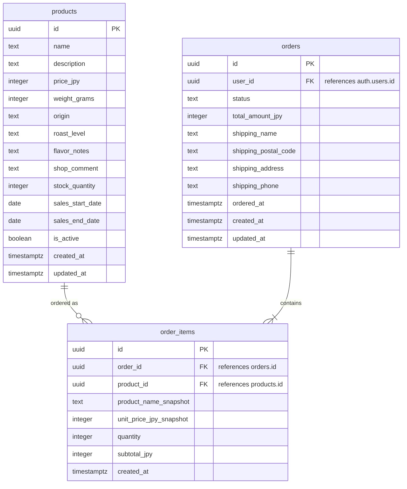

# データモデル設計

## 概要

このファイルは、自家焙煎のカフェ豆を販売する小規模ECの初回リリース向けデータモデルを整理したものです。  
商品表示、注文、注文明細に必要な最小構成として、`products` / `orders` / `order_items` の3テーブルに絞ります。  
認証は Supabase Auth の `auth.users` を利用し、アプリ側では `orders.user_id` で参照します。

## テーブル一覧

| テーブル名 | 用途 |
|---|---|
| `products` | 販売するコーヒー豆の商品情報を管理する |
| `orders` | ユーザーごとの注文情報、配送先、注文金額、注文状態を管理する |
| `order_items` | 注文に含まれる商品ごとの明細を管理する |

## ER図

## カラム一覧

### `products`

| カラム名 | 型 | 説明 |
|---|---|---|
| `id` | `uuid` | 商品ID。主キー |
| `name` | `text` | 商品名 |
| `description` | `text` | 商品説明 |
| `price_jpy` | `integer` | 販売価格。日本円 |
| `weight_grams` | `integer` | 内容量。グラム単位 |
| `origin` | `text` | 産地 |
| `roast_level` | `text` | 焙煎度 |
| `flavor_notes` | `text` | 味や香りの特徴 |
| `shop_comment` | `text` | 店主のおすすめコメント |
| `stock_quantity` | `integer` | 在庫数 |
| `sales_start_date` | `date` | 販売開始日 |
| `sales_end_date` | `date` | 販売終了日 |
| `is_active` | `boolean` | 商品を公開中かどうか |
| `created_at` | `timestamptz` | 作成日時 |
| `updated_at` | `timestamptz` | 更新日時 |

### `orders`

| カラム名 | 型 | 説明 |
|---|---|---|
| `id` | `uuid` | 注文ID。主キー |
| `user_id` | `uuid` | 注文したユーザーID。`auth.users.id` を参照 |
| `status` | `text` | 注文状態。例: `pending`, `paid`, `shipped`, `cancelled` |
| `total_amount_jpy` | `integer` | 注文合計金額。日本円 |
| `shipping_name` | `text` | 配送先の氏名 |
| `shipping_postal_code` | `text` | 配送先の郵便番号 |
| `shipping_address` | `text` | 配送先住所 |
| `shipping_phone` | `text` | 配送先電話番号 |
| `ordered_at` | `timestamptz` | 注文日時 |
| `created_at` | `timestamptz` | 作成日時 |
| `updated_at` | `timestamptz` | 更新日時 |

### `order_items`

| カラム名 | 型 | 説明 |
|---|---|---|
| `id` | `uuid` | 注文明細ID。主キー |
| `order_id` | `uuid` | 注文ID。`orders.id` を参照 |
| `product_id` | `uuid` | 商品ID。`products.id` を参照 |
| `product_name_snapshot` | `text` | 注文時点の商品名 |
| `unit_price_jpy_snapshot` | `integer` | 注文時点の単価。日本円 |
| `quantity` | `integer` | 注文数量 |
| `subtotal_jpy` | `integer` | 明細ごとの小計。日本円 |
| `created_at` | `timestamptz` | 作成日時 |

## 補足

- ユーザー情報は Supabase Auth の `auth.users` に任せるため、アプリ側では `users` や `profiles` テーブルを作りません。
- `orders.user_id` は `auth.users.id` を参照する外部キーとして扱います。
- `order_items` に `product_name_snapshot` と `unit_price_jpy_snapshot` を持たせることで、注文後に商品名や価格が変わっても注文時点の内容を保持できます。
- `subtotal_jpy` は `unit_price_jpy_snapshot * quantity` の結果を保存します。注文履歴や売上集計で、注文時点の金額をそのまま参照しやすくするためです。
- 初回リリースでは、味タグ、お気に入り、レビュー、定期購入などの追加機能用テーブルは作りません。
