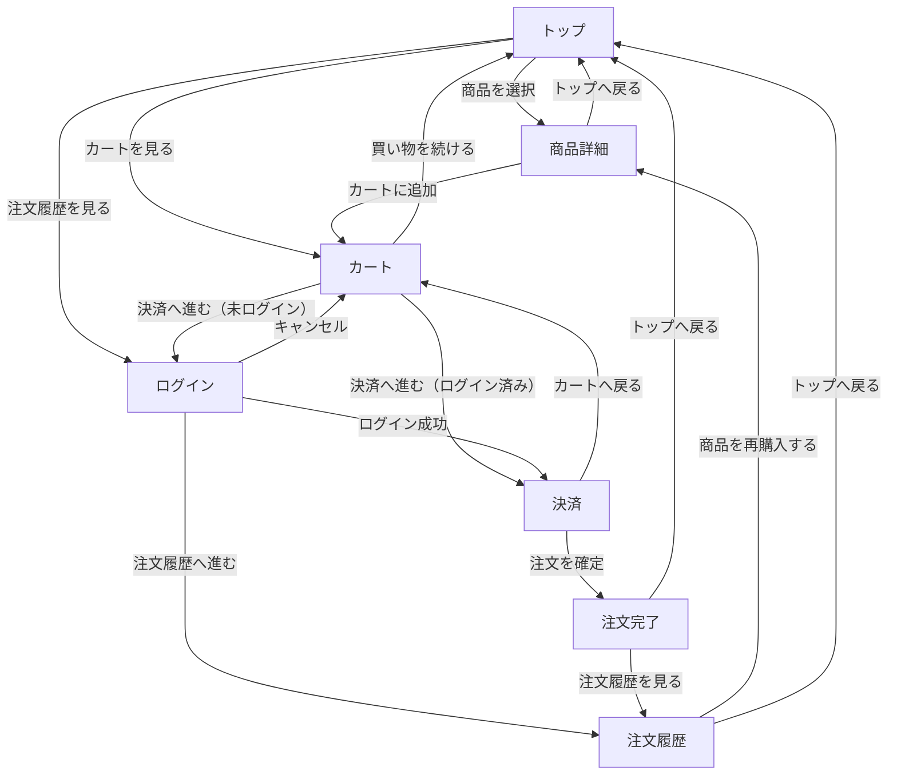
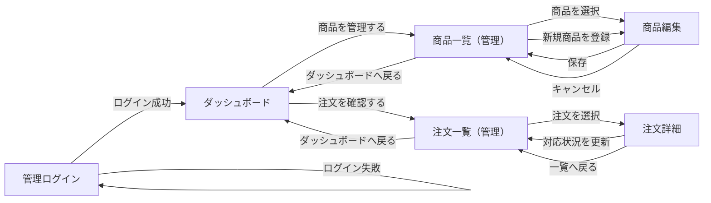

# 画面遷移図

## 概要

このファイルは、自家焙煎コーヒー豆ECの初回リリースにおける画面遷移を整理したものです。  
お客さん側の購入導線と、店舗運営者側の商品・注文管理導線を分けて記載します。  
初回リリースで必要な画面に絞り、未ログイン時の分岐や管理ログインの前提も明示します。

## 画面一覧

| 画面名 | 役割 |
|---|---|
| トップ | 今月販売しているコーヒー豆を一覧で見せる |
| 商品詳細 | 豆の特徴、価格、在庫、販売期間、店主コメントを見せる |
| カート | 購入予定の商品、数量、小計を確認する |
| ログイン | 購入手続きや注文履歴の確認に必要な認証を行う |
| 決済 | 配送先、注文内容、支払い情報を確認して注文を確定する |
| 注文完了 | 注文が完了したことを知らせる |
| 注文履歴 | 過去の注文内容を確認する |
| 管理ログイン | 店舗運営者が管理画面に入るための認証を行う |
| ダッシュボード | 商品管理や注文管理への入口になる |
| 商品一覧（管理） | 登録済み商品の一覧、在庫、公開状態を確認する |
| 商品編集 | 商品情報、価格、在庫、販売期間を登録・編集する |
| 注文一覧（管理） | 注文状況を一覧で確認する |
| 注文詳細 | 注文内容、配送先、対応状況を確認・更新する |

## お客さん側の遷移

## 運営者側の遷移

## 補足

- カートから決済へ進むとき、ログイン済みであればそのまま決済へ進みます。
- 未ログインの場合はログイン画面を挟み、ログイン成功後に決済へ進みます。
- 注文履歴はユーザーごとの注文情報を表示するため、ログイン後に閲覧できる想定です。
- 管理画面は管理ログインを通過しないとダッシュボードへ入れない構成にします。
- 初回リリースでは、お気に入り、レビュー、再入荷通知、定期購入、詳細な顧客管理画面は見送ります。
